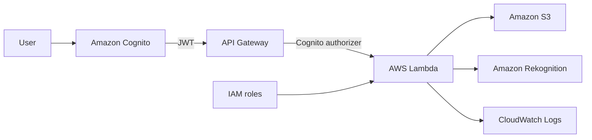

# Serverless AI Image Catalog

Spring-based serverless image catalog built with AWS Lambda, API Gateway, S3, DynamoDB, Rekognition, CloudFormation, and GitHub Actions.

## Architecture

- `POST /images/upload` uploads an image and stores its initial metadata in DynamoDB with status `PROCESSING`.
- S3 `ObjectCreated` on `original/` triggers image processing.
- Processing Lambda creates a thumbnail, calls Amazon Rekognition for labels and moderation, and updates DynamoDB.
- `GET /images/my` returns images uploaded by the authenticated user.
- `GET /images/all` returns all image records for administrators.
- `POST /images/{id}/approve` and `POST /images/{id}/reject` allow administrators to moderate image records.



## Security Architecture

Amazon Cognito is the external identity provider for the API. Clients authenticate with the Cognito User Pool, receive a JWT, and pass it as `Authorization: Bearer <id-token>` when calling API Gateway.

API Gateway uses a Cognito JWT authorizer on every route. Requests without a valid JWT are rejected with `401 Unauthorized` before Lambda is invoked. Lambda then enforces role-based access control from the `cognito:groups` claim and returns `403 Forbidden` for authenticated users without the required group.

Role access:

- `POST /images/upload`: `USER`, `ADMIN`
- `GET /images/my`: `USER`, `ADMIN`
- `GET /images/all`: `ADMIN`
- `POST /images/{id}/approve`: `ADMIN`
- `POST /images/{id}/reject`: `ADMIN`

The CloudFormation stack creates the Cognito User Pool, User Pool Client, and `USER`/`ADMIN` groups. Demo users are intentionally not hardcoded in IaC; create them manually for exam/demo runs. Production users should be managed through a real onboarding, invitation, federation, or identity governance flow rather than committed CloudFormation users.

Lambda execution permissions are scoped to the required S3 object prefixes, the image metadata DynamoDB table, Rekognition label/moderation APIs, and explicit CloudWatch log groups. SSM Parameter Store is used for environment-specific image prefix configuration, and secrets must not be hardcoded in source code or templates.

Amazon Rekognition moderation labels act as a content safety/security control during image processing. CloudWatch logs include authenticated user identity, Cognito groups, upload events, Rekognition results, approval/rejection decisions, and forbidden access attempts. Tokens and secrets are not logged.

## Tech Stack

- Spring Boot 4
- Java 25
- Spring Cloud Function for AWS Lambda handlers
- AWS SDK for Java v2
- DynamoDB for metadata
- S3 for original and thumbnail files
- Amazon Rekognition for labels and moderation
- CloudFormation for infrastructure
- GitHub Actions for CI/CD

## Project Structure

- `build.gradle`
- `src/main/java/com/demo/catalog`
- `infra/01-artifact-bucket.yaml`
- `infra/02-image-catalog.yaml`
- `.github/workflows/deploy.yml`

## API Notes

`POST /images/upload` supports:

- raw image bytes through API Gateway binary payloads
- JSON payloads shaped like:

```json
{
  "fileName": "tea.jpg",
  "contentType": "image/jpeg",
  "base64Data": "..."
}
```

Example response:

```json
{
  "imageId": "img-12345678",
  "status": "PROCESSING"
}
```

## Deploy Flow

1. Push to `main` or run the GitHub Actions workflow manually.
2. Workflow builds `app.jar`.
3. Workflow uploads the jar to the deployment S3 bucket.
4. Workflow deploys the CloudFormation stack.
5. Stack output returns the API Gateway base URL.

## Demo Auth Flow

After deployment, collect stack outputs:

```bash
STACK_NAME=image-catalog
REGION=us-east-1

API_BASE_URL=$(aws cloudformation describe-stacks \
  --stack-name "$STACK_NAME" \
  --region "$REGION" \
  --query "Stacks[0].Outputs[?OutputKey=='ApiBaseUrl'].OutputValue" \
  --output text)

USER_POOL_ID=$(aws cloudformation describe-stacks \
  --stack-name "$STACK_NAME" \
  --region "$REGION" \
  --query "Stacks[0].Outputs[?OutputKey=='CognitoUserPoolId'].OutputValue" \
  --output text)

CLIENT_ID=$(aws cloudformation describe-stacks \
  --stack-name "$STACK_NAME" \
  --region "$REGION" \
  --query "Stacks[0].Outputs[?OutputKey=='CognitoUserPoolClientId'].OutputValue" \
  --output text)
```

Create demo users manually and assign groups:

```bash
USER_PASSWORD='ReplaceMe-User-123!'
ADMIN_PASSWORD='ReplaceMe-Admin-123!'

aws cognito-idp admin-create-user \
  --user-pool-id "$USER_POOL_ID" \
  --region "$REGION" \
  --username user@example.com \
  --user-attributes Name=email,Value=user@example.com Name=email_verified,Value=true

aws cognito-idp admin-set-user-password \
  --user-pool-id "$USER_POOL_ID" \
  --region "$REGION" \
  --username user@example.com \
  --password "$USER_PASSWORD" \
  --permanent

aws cognito-idp admin-add-user-to-group \
  --user-pool-id "$USER_POOL_ID" \
  --region "$REGION" \
  --username user@example.com \
  --group-name USER

aws cognito-idp admin-create-user \
  --user-pool-id "$USER_POOL_ID" \
  --region "$REGION" \
  --username admin@example.com \
  --user-attributes Name=email,Value=admin@example.com Name=email_verified,Value=true

aws cognito-idp admin-set-user-password \
  --user-pool-id "$USER_POOL_ID" \
  --region "$REGION" \
  --username admin@example.com \
  --password "$ADMIN_PASSWORD" \
  --permanent

aws cognito-idp admin-add-user-to-group \
  --user-pool-id "$USER_POOL_ID" \
  --region "$REGION" \
  --username admin@example.com \
  --group-name ADMIN
```

Get JWT ID tokens:

```bash
USER_ID_TOKEN=$(aws cognito-idp admin-initiate-auth \
  --user-pool-id "$USER_POOL_ID" \
  --client-id "$CLIENT_ID" \
  --region "$REGION" \
  --auth-flow ADMIN_USER_PASSWORD_AUTH \
  --auth-parameters USERNAME=user@example.com,PASSWORD="$USER_PASSWORD" \
  --query "AuthenticationResult.IdToken" \
  --output text)

ADMIN_ID_TOKEN=$(aws cognito-idp admin-initiate-auth \
  --user-pool-id "$USER_POOL_ID" \
  --client-id "$CLIENT_ID" \
  --region "$REGION" \
  --auth-flow ADMIN_USER_PASSWORD_AUTH \
  --auth-parameters USERNAME=admin@example.com,PASSWORD="$ADMIN_PASSWORD" \
  --query "AuthenticationResult.IdToken" \
  --output text)
```

Call the user endpoint successfully:

```bash
IMAGE_B64=$(base64 < images/tea1.jpg | tr -d '\n')

curl -i -X POST "$API_BASE_URL/images/upload" \
  -H "Authorization: Bearer $USER_ID_TOKEN" \
  -H "Content-Type: application/json" \
  -d "{\"contentType\":\"image/jpeg\",\"base64Data\":\"$IMAGE_B64\"}"
```

Try an admin endpoint as `USER` and receive `403 Forbidden`:

```bash
curl -i "$API_BASE_URL/images/all" \
  -H "Authorization: Bearer $USER_ID_TOKEN"
```

Call the admin endpoint successfully:

```bash
curl -i "$API_BASE_URL/images/all" \
  -H "Authorization: Bearer $ADMIN_ID_TOKEN"
```

Approve or reject an image as `ADMIN`:

```bash
IMAGE_ID=img-12345678

curl -i -X POST "$API_BASE_URL/images/$IMAGE_ID/approve" \
  -H "Authorization: Bearer $ADMIN_ID_TOKEN"

curl -i -X POST "$API_BASE_URL/images/$IMAGE_ID/reject" \
  -H "Authorization: Bearer $ADMIN_ID_TOKEN"
```

## Important Note

The Gradle wrapper jar is not committed in this workspace snapshot, so `./gradlew` will not run locally until the wrapper is generated once in a network-enabled environment.
